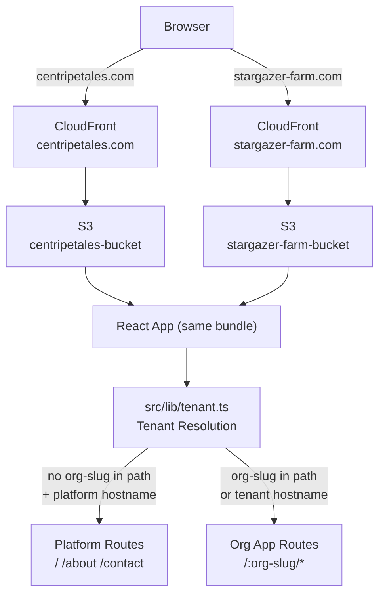
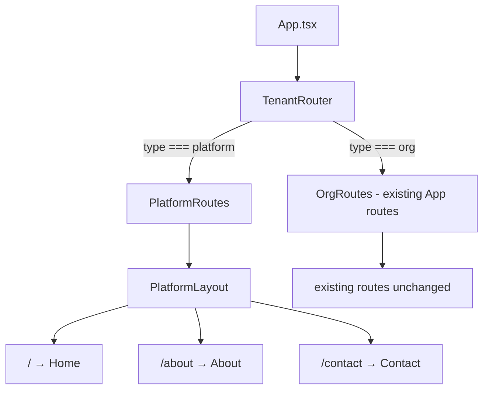

# Design Document: Centripetal ES Website

## Overview

This design adds a public-facing platform layer to the existing CWF repository. The result is a single codebase that serves two distinct experiences from one build artifact:

1. **centripetales.com** — the Centripetal ES platform site (public, no auth), with pages at `/`, `/about`, and `/contact`.
2. **stargazer-farm.com** (and future tenant domains) — the existing operational farm app, now mounted at `/:org-slug/` under the platform routing structure.

The key architectural insight is that the app already has multi-org support via `organizations.subdomain`. This design extends that to also support hostname-based tenant resolution, so `stargazer-farm.com` and `centripetales.com/stargazer-farm` both resolve to the same tenant context.

No new backend infrastructure is required. The tenant resolution is purely a frontend concern — it reads the hostname and/or URL path at startup and selects the appropriate routing tree.

---

## Architecture

### Routing Tree

The existing `App.tsx` mounts all routes at the root. This design restructures the router into two parallel trees, selected at startup based on tenant context:

```
BrowserRouter
└── TenantRouter (reads hostname + path to determine context)
    ├── Platform context (centripetales.com with no org-slug path)
    │   └── PlatformLayout
    │       ├── /           → Home
    │       ├── /about      → About
    │       └── /contact    → Contact
    └── Tenant context (any org-slug present, or non-platform hostname)
        └── (existing App routes, prefixed with /:org-slug/ or at root)
            ├── /auth
            ├── /dashboard
            ├── /actions
            └── ... (all existing routes unchanged)
```

The tenant context determination happens once at app startup in `src/lib/tenant.ts`. The result is passed down via a `TenantContext` React context so any component can read the current tenant.

### Dual Deployment

One build artifact is deployed to two S3 buckets. CloudFront handles domain routing — each distribution points to its own bucket but serves the same `index.html`. The SPA routing (React Router) then handles the rest client-side.

```
GitHub Actions
└── npm run build (once)
    ├── → S3: centripetales-bucket  → CloudFront: centripetales.com
    └── → S3: stargazer-farm-bucket → CloudFront: stargazer-farm.com
```

Because both distributions serve the same JS bundle, the tenant resolution logic in `src/lib/tenant.ts` uses `window.location.hostname` at runtime to determine which experience to show — no build-time branching needed.

### System Context Diagram



---

## Components and Interfaces

### `src/lib/tenant.ts`

The single source of truth for tenant resolution. Exports a pure function and a React hook.

```typescript
export interface TenantContext {
  type: 'platform' | 'org';
  orgSlug: string | null;  // null when type === 'platform'
}

/**
 * Resolves tenant context from hostname and pathname.
 * Pure function — no side effects, no API calls.
 *
 * Resolution rules (in priority order):
 * 1. If hostname is 'localhost' → org context, slug = 'stargazer-farm'
 * 2. If hostname matches a known tenant domain (e.g. stargazer-farm.com) → org context, slug = subdomain part
 * 3. If first path segment is a non-platform slug (not '', 'about', 'contact') → org context, slug = path segment
 * 4. Otherwise → platform context
 */
export function resolveTenant(hostname: string, pathname: string): TenantContext;

/**
 * React hook — reads window.location at mount time and returns stable TenantContext.
 * Memoized; does not re-run on navigation.
 */
export function useTenantContext(): TenantContext;
```

**Tenant domain mapping** is a static map of known custom domains to their org slugs. This is the only place that needs updating when a tenant gets a custom domain. Adding a new tenant via subdomain path (e.g. `centripetales.com/new-farm`) requires no code change — the path segment is used directly as the slug.

### `src/components/platform/PlatformLayout.tsx`

Wraps all public platform pages. Contains header, nav, and footer. No auth dependency.

```typescript
interface PlatformLayoutProps {
  children: React.ReactNode;
}

export function PlatformLayout({ children }: PlatformLayoutProps): JSX.Element;
```

Internal structure:
- `<header>` — Centripetal ES wordmark + `<nav>` with `<NavLink>` to `/`, `/about`, `/contact`
- `<main>` — `{children}`
- `<footer>` — copyright, secondary links

### Platform Page Components

All three are self-contained React components with no props. They use `PlatformLayout` as their outer wrapper.

```
src/pages/platform/
├── Home.tsx     — route: /
├── About.tsx    — route: /about
└── Contact.tsx  — route: /contact
```

Each page renders placeholder sections using Tailwind + shadcn-ui. No content abstraction layer — sections are hardcoded JSX with placeholder text. Content is filled in by editing the component directly.

### `src/App.tsx` — Router Changes

The existing `App.tsx` is modified to wrap the existing routes inside a tenant-aware router component. The platform routes are added as a parallel branch. The existing routes are preserved exactly — they move to `/:org-slug/*` when accessed via the platform domain, but remain at their current paths when accessed via a tenant domain (e.g. `stargazer-farm.com/dashboard`).



---

## Data Models

### TenantContext (frontend only)

```typescript
interface TenantContext {
  /** 'platform' = centripetales.com public site, 'org' = farm portal */
  type: 'platform' | 'org';
  /** The org subdomain slug, e.g. 'stargazer-farm'. Null for platform context. */
  orgSlug: string | null;
}
```

### Organization (existing, relevant field)

From the existing `organizations` table — no schema changes needed:

```sql
organizations {
  id        uuid PK
  name      text
  subdomain text   -- e.g. 'stargazer-farm' — used for tenant resolution
  ...
}
```

The `subdomain` field is already populated for existing orgs. New orgs get a subdomain at creation time. No migration required.

---

## Correctness Properties

*A property is a characteristic or behavior that should hold true across all valid executions of a system — essentially, a formal statement about what the system should do. Properties serve as the bridge between human-readable specifications and machine-verifiable correctness guarantees.*

### Property 1: Tenant resolution is deterministic and total

*For any* combination of hostname and pathname, `resolveTenant` SHALL return a valid `TenantContext` — never throw, never return null, and always return either `{ type: 'platform' }` or `{ type: 'org', orgSlug: string }`.

**Validates: Requirements 1.5, 1.6**

### Property 2: Localhost always resolves to org context

*For any* pathname, when hostname is `'localhost'`, `resolveTenant` SHALL return `{ type: 'org', orgSlug: 'stargazer-farm' }`.

**Validates: Requirements 1.7**

### Property 3: Path-based org resolution round-trips

*For any* non-reserved path segment used as an org slug (i.e. not `''`, `'about'`, `'contact'`, `'auth'`), `resolveTenant('centripetales.com', '/' + slug + '/...')` SHALL return `{ type: 'org', orgSlug: slug }`.

**Validates: Requirements 1.3, 1.5, 1.11**

### Property 4: Platform routes render without authentication

*For any* platform route (`/`, `/about`, `/contact`), rendering the route tree without an authenticated user SHALL NOT redirect to `/auth` and SHALL render the corresponding platform page component.

**Validates: Requirements 3.4, 4.3, 6.3**

### Property 5: Active NavLink matches current route

*For any* platform route the user is currently on, the `NavLink` in `PlatformLayout` corresponding to that route SHALL have the active styling applied, and all other NavLinks SHALL NOT have active styling.

**Validates: Requirements 7.4**

---

## Error Handling

### Unknown org slug

If the path contains a segment that looks like an org slug but no matching org is found in the database, the existing `NotFound` page is shown. The tenant resolution itself does not fail — it returns `{ type: 'org', orgSlug: <the-slug> }` and the org data fetch returns 404, which the existing error handling in `OrganizationProvider` already handles.

### Hostname not recognized

If the hostname is not `localhost`, not `centripetales.com`, and not in the known tenant domain map, the app defaults to platform context. This is a safe fallback — the public site is shown rather than a broken org app.

### Missing subdomain field

If an org in the database has a null `subdomain`, it cannot be resolved by hostname or path. This is an existing data integrity concern, not introduced by this feature. The resolution function treats null subdomains as non-matching.

---

## Testing Strategy

### Unit Tests

- `resolveTenant` pure function — test all resolution branches:
  - localhost → stargazer-farm
  - known tenant hostname → correct slug
  - platform hostname + no org path → platform context
  - platform hostname + org path segment → org context
  - unknown hostname → platform context (safe fallback)
- `PlatformLayout` — render test verifying nav links and footer are present
- `Home`, `About`, `Contact` — render tests verifying placeholder sections exist

### Property-Based Tests

Using [fast-check](https://github.com/dubzzz/fast-check) (already consistent with the TypeScript/Vite stack):

**Property 1: Deterministic and total**
Generate arbitrary `(hostname, pathname)` string pairs. Assert `resolveTenant` always returns a valid `TenantContext` without throwing.
*Feature: centripetal-es-website, Property 1: resolveTenant is total*

**Property 2: Localhost invariant**
Generate arbitrary pathnames. Assert `resolveTenant('localhost', pathname)` always returns `{ type: 'org', orgSlug: 'stargazer-farm' }`.
*Feature: centripetal-es-website, Property 2: localhost always resolves to stargazer-farm*

**Property 3: Path-based org resolution round-trips**
Generate arbitrary non-reserved slugs (alphanumeric + hyphens, not in reserved set). Assert `resolveTenant('centripetales.com', '/' + slug)` returns `{ type: 'org', orgSlug: slug }`.
*Feature: centripetal-es-website, Property 3: path-based org resolution round-trips*

**Property 4: Platform routes render without auth**
For each of the three platform routes, render without `AuthProvider` (or with unauthenticated mock). Assert no redirect to `/auth` occurs.
*Feature: centripetal-es-website, Property 4: platform routes render without auth*

**Property 5: Active NavLink matches current route**
For each platform route, render `PlatformLayout` with that route active. Assert exactly one NavLink has the active class, and it matches the current route.
*Feature: centripetal-es-website, Property 5: active NavLink matches current route*

Each property test runs a minimum of 100 iterations.

### Integration Tests

- Build artifact deploys successfully to both S3 buckets (verified in CI)
- CloudFront distributions serve correct `index.html` for both domains

---

## Deployment Architecture

### GitHub Actions Workflow Changes

The existing `deploy.yml` deploys to GitHub Pages. This will be replaced with a dual-S3 deployment:

```yaml
jobs:
  build:
    # Single build step — produces ./dist
    runs-on: ubuntu-latest
    steps:
      - npm ci
      - npm run build

  deploy-centripetales:
    needs: build
    # aws s3 sync ./dist s3://centripetales-bucket --delete
    # aws cloudfront create-invalidation --distribution-id $CF_CENTRIPETALES_ID

  deploy-stargazer-farm:
    needs: build
    # aws s3 sync ./dist s3://stargazer-farm-bucket --delete
    # aws cloudfront create-invalidation --distribution-id $CF_STARGAZER_ID
```

Both deploy jobs run in parallel (`needs: build`), sharing the same build artifact via GitHub Actions cache or artifact upload/download.

### CloudFormation Additions

Two new resources added to `cloudformation/cwf-infrastructure.yaml`:

**S3 Buckets** (one per domain, configured for SPA hosting):
- `CentripetalesBucket` — `centripetales-bucket`, static website hosting, `index.html` as error document
- `StargazerFarmBucket` — `stargazer-farm-bucket`, same configuration

**CloudFront Distributions** (one per domain):
- `CentripetalesDistribution` — origin: `CentripetalesBucket`, CNAME: `centripetales.com`, ACM cert
- `StargazerFarmDistribution` — origin: `StargazerFarmBucket`, CNAME: `stargazer-farm.com`, ACM cert

Both distributions use the same CloudFront error page configuration: redirect 403/404 → `/index.html` with 200 status (required for SPA client-side routing).

---

## File and Folder Structure

```
src/
├── App.tsx                          ← modified: adds TenantRouter, platform routes
├── main.tsx                         ← unchanged
│
├── lib/
│   ├── tenant.ts                    ← NEW: tenant resolution logic
│   └── ... (existing files)
│
├── pages/
│   ├── platform/                    ← NEW directory
│   │   ├── Home.tsx                 ← NEW: / route
│   │   ├── About.tsx                ← NEW: /about route
│   │   └── Contact.tsx              ← NEW: /contact route
│   └── ... (existing pages unchanged)
│
├── components/
│   ├── platform/                    ← NEW directory
│   │   └── PlatformLayout.tsx       ← NEW: header + nav + footer wrapper
│   └── ... (existing components unchanged)
│
└── styles/
    └── ... (existing styles)

public/
├── images/                          ← NEW directory (placeholder, populated later)
├── icons/                           ← NEW directory (placeholder, populated later)
└── ... (existing public assets)

cloudformation/
└── cwf-infrastructure.yaml          ← modified: adds S3 buckets + CloudFront distributions

.github/workflows/
└── deploy.yml                       ← modified: dual S3 deployment
```

---

## Design Decisions

**Why not a separate repo?** The platform site and the farm app share the same API, auth system, and component library. A single repo avoids dependency drift and simplifies deployment.

**Why runtime tenant resolution instead of build-time?** A single build artifact is simpler to maintain and deploy. Runtime resolution via `window.location.hostname` is reliable and adds no meaningful overhead.

**Why no content abstraction layer?** The requirements explicitly call for placeholder content to be filled in later. A CMS or content layer would add complexity before the content even exists. Plain JSX components are the simplest thing that works — refactoring to a content layer later is straightforward.

**Why keep existing routes unchanged?** The existing app routes (`/dashboard`, `/actions`, etc.) work correctly when accessed via a tenant domain (e.g. `stargazer-farm.com/dashboard`). Prefixing them with `/:org-slug/` would break all existing bookmarks and links. The tenant context is determined by hostname, not by path prefix, so no path changes are needed for the existing app.

**Why `/:org-slug/` path routing at all then?** For the `centripetales.com` domain specifically, path-based routing is needed so that `centripetales.com/stargazer-farm` can reach the farm app. This is an alternative access path — the primary access for Stargazer Farm remains `stargazer-farm.com`.
