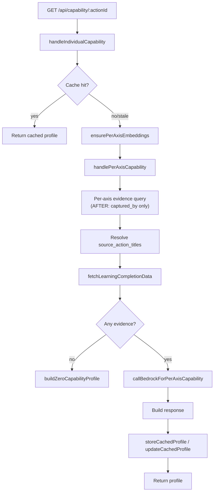

# Design Document

## Feature: Experience-Based Capability Evidence

---

## Overview

The per-axis capability scoring system currently retrieves evidence only from states that are linked to learning objectives on the specific action being assessed. This is overly narrow: a user's field observations, action updates, and notes written on any action across the organisation are ignored unless they happen to be linked to a learning objective.

This feature removes the `INNER JOIN state_links sl ON sl.entity_type = 'learning_objective'` from the per-axis evidence query in `handlePerAxisCapability`. After the change, the sole eligibility criterion for evidence is authorship: `captured_by = userId`. The top-N selection by cosine similarity to the `skill_axis` embedding, the `[capability_profile]` / `[learning_objective]` prefix exclusions, the cache logic, the Bedrock prompt, and the response shape are all unchanged.

The change is surgical: one join removed, one comment updated. Everything else — `fetchEvidenceStateIds`, `determineEvidenceTypeEnriched`, `callBedrockForPerAxisCapability`, `handleOrganizationCapability`, and all cache helpers — remains untouched.

---

## Architecture

The capability Lambda follows a cache-first, per-axis evidence retrieval architecture:



The only node that changes is **G** — the per-axis evidence query. All other nodes are unaffected.

### What Changes

| Location | Before | After |
|---|---|---|
| `handlePerAxisCapability` — `axisSearchResult` query | `INNER JOIN state_links sl ON sl.state_id = s.id AND sl.entity_type = 'learning_objective'` present | Join removed |
| `handlePerAxisCapability` — comment | "INNER JOIN state_links restricts to learning-objective-linked states only" | Updated to reflect new behaviour |

### What Does Not Change

- `fetchEvidenceStateIds` — already queries all `captured_by = userId` states with the same prefix exclusions; the cache hash is already consistent with the expanded pool.
- `determineEvidenceTypeEnriched` / `capabilityUtils.js` — evidence classification is unchanged.
- `callBedrockForPerAxisCapability` — tag-building, `source_action_title` resolution, `EVIDENCE TYPE INTERPRETATION` section, and axis `description` inclusion are all unchanged.
- `handleOrganizationCapability` — explicitly out of scope; its own `INNER JOIN state_links` is not touched.
- Cache helpers (`lookupCachedProfile`, `storeCachedProfile`, `updateCachedProfile`) — unchanged.
- Response shape — unchanged.

---

## Components and Interfaces

### `handlePerAxisCapability` (modified)

**File**: `lambda/capability/index.js`

**Signature** (unchanged):
```js
async function handlePerAxisCapability(db, actionId, userId, organizationId, skillProfile, userName, aiConfig)
```

**Current per-axis query** (inside the `for (const axis of skillProfile.axes)` loop):
```sql
SELECT ue.entity_id, ue.embedding_source, s.state_text,
       (1 - (ue.embedding <=> (SELECT embedding FROM unified_embeddings
                                WHERE entity_type = 'skill_axis'
                                  AND action_id = $1
                                  AND axis_key = $2 LIMIT 1))) as similarity
FROM unified_embeddings ue
INNER JOIN states s ON s.id::text = ue.entity_id
INNER JOIN state_links sl ON sl.state_id = s.id AND sl.entity_type = 'learning_objective'
WHERE ue.entity_type = 'state'
  AND ue.organization_id = '${orgIdSafe}'
  AND s.captured_by = '${userIdSafe}'
ORDER BY similarity DESC
LIMIT ${aiConfig.evidence_limit}
```

**After change** (remove the `INNER JOIN state_links` line):
```sql
SELECT ue.entity_id, ue.embedding_source, s.state_text,
       (1 - (ue.embedding <=> (SELECT embedding FROM unified_embeddings
                                WHERE entity_type = 'skill_axis'
                                  AND action_id = $1
                                  AND axis_key = $2 LIMIT 1))) as similarity
FROM unified_embeddings ue
INNER JOIN states s ON s.id::text = ue.entity_id
WHERE ue.entity_type = 'state'
  AND ue.organization_id = '${orgIdSafe}'
  AND s.captured_by = '${userIdSafe}'
  AND s.state_text NOT LIKE '[capability_profile]%'
  AND s.state_text NOT LIKE '[learning_objective]%'
ORDER BY similarity DESC
LIMIT ${aiConfig.evidence_limit}
```

The prefix exclusion clauses (`NOT LIKE '[capability_profile]%'` and `NOT LIKE '[learning_objective]%'`) are added directly to the query, consistent with the identical exclusions already present in `fetchEvidenceStateIds`. This ensures the evidence pool and the cache hash computation draw from the same set of states.

### `fetchEvidenceStateIds` (unchanged)

Already queries all states where `captured_by = userId` with the same prefix exclusions. No change needed — the cache hash is already aligned with the expanded evidence pool.

### `determineEvidenceTypeEnriched` (unchanged)

Pure function in `capabilityUtils.js`. Classifies any state text as recognition quiz, open-form quiz, or observation. No change needed — it already handles both evidence types.

### `callBedrockForPerAxisCapability` (unchanged)

The prompt already uses neutral language ("per-axis evidence"), already includes `source_action_title` per evidence item, and already has the `EVIDENCE TYPE INTERPRETATION` section. No wording change is required.

### `handleOrganizationCapability` (unchanged)

Has its own evidence query with the same `INNER JOIN state_links` pattern. Explicitly out of scope.

---

## Data Models

No schema changes. The feature operates entirely within the existing tables:

| Table | Role |
|---|---|
| `unified_embeddings` | Source of state embeddings; queried with `entity_type = 'state'` and `organization_id` filter |
| `states` | Joined to get `state_text` and `captured_by`; filtered by `captured_by = userId` and prefix exclusions |
| `state_links` | No longer joined in the per-axis evidence query (still used by `fetchLearningCompletionData`, cache helpers, and `handleOrganizationCapability`) |

### Evidence Pool — Before vs After

| Criterion | Before | After |
|---|---|---|
| `ue.entity_type = 'state'` | ✓ | ✓ |
| `ue.organization_id = organizationId` | ✓ | ✓ |
| `s.captured_by = userId` | ✓ | ✓ |
| `state_links` row with `entity_type = 'learning_objective'` | **required** | **removed** |
| `state_text NOT LIKE '[capability_profile]%'` | implicit (via `state_links` restriction) | **explicit** |
| `state_text NOT LIKE '[learning_objective]%'` | implicit (via `state_links` restriction) | **explicit** |
| Ranked by cosine similarity to `skill_axis` embedding | ✓ | ✓ |
| Limited to `aiConfig.evidence_limit` | ✓ | ✓ |

The prefix exclusions were previously implicit — `[capability_profile]` and `[learning_objective]` states are never linked to learning objectives, so the old join naturally excluded them. With the join removed, the exclusions must be made explicit in the query.

---

## Correctness Properties

*A property is a characteristic or behavior that should hold true across all valid executions of a system — essentially, a formal statement about what the system should do. Properties serve as the bridge between human-readable specifications and machine-verifiable correctness guarantees.*

### Property Reflection

Before writing the final properties, reviewing the prework for redundancy:

- **1.1 and 1.5** are the same property stated from two angles (states without learning_objective links must appear). Merge into one property: "all captured_by states appear in the pool."
- **1.2** (org scoping) and **1.6** (prefix exclusion) are distinct filter invariants — keep both.
- **1.3** (similarity ordering) and **1.4** (evidence_limit cardinality) are distinct ordering/cardinality invariants — keep both.
- **2.1** (quiz states included) is a specific instance of 1.1 (captured_by is the only criterion). It adds value as a distinct property because it explicitly verifies quiz states are not accidentally excluded by the new query — keep as a combined property with 1.1.
- **2.2** (`determineEvidenceTypeEnriched` classification) is a pure-function property — keep.
- **4.1** (tag building) and **4.2** (source_action_title in prompt) are distinct prompt-construction properties — keep both.
- **4.4** (axis description in prompt) can be combined with 4.1/4.2 into a single "prompt construction" property.
- **5.1** (response shape) is a structural invariant — keep.

After reflection: 7 distinct properties covering the core correctness concerns.

---

### Property 1: Evidence pool contains all user-authored states regardless of action assignment

*For any* user and organisation, the per-axis evidence pool must contain all states where `captured_by = userId` and `organization_id = organizationId` — including states written on actions the user is not assigned to and states that are quiz answers — without requiring any `state_links` row.

**Validates: Requirements 1.1, 1.5, 2.1**

---

### Property 2: Evidence pool is scoped to the user's organisation

*For any* user in organisation A, no state from organisation B must appear in the per-axis evidence pool, regardless of the user's authorship of states in other organisations.

**Validates: Requirements 1.2**

---

### Property 3: Prefix-excluded states never appear in the evidence pool

*For any* user, states whose `state_text` begins with `[capability_profile]` or `[learning_objective]` must never appear in the per-axis evidence pool.

**Validates: Requirements 1.6**

---

### Property 4: Evidence items are returned in descending similarity order

*For any* axis evidence result containing two or more items, the `similarity_score` of item at index `i` must be greater than or equal to the `similarity_score` of item at index `i+1`.

**Validates: Requirements 1.3**

---

### Property 5: Evidence count per axis never exceeds the configured limit

*For any* axis, the number of evidence items returned must be less than or equal to `aiConfig.evidence_limit`.

**Validates: Requirements 1.4**

---

### Property 6: Evidence type classification is total and consistent

*For any* state text, `determineEvidenceTypeEnriched` must return a result where:
- `type` is exactly `'quiz'` or `'observation'`
- if `type === 'observation'`, then `questionType`, `continuousScore`, and `evaluationStatus` are all `null`
- if `type === 'quiz'` and `questionType === 'recognition'`, then `continuousScore` and `evaluationStatus` are `null`
- if `type === 'quiz'` and `questionType` is an open-form type, then `evaluationStatus` is one of `'pending'`, `'sufficient'`, `'insufficient'`, `'error'`, or `null`

**Validates: Requirements 2.2**

---

### Property 7: Response shape is structurally complete for any valid input

*For any* successful capability computation, the response object must contain exactly the fields `user_id`, `user_name`, `action_id`, `narrative`, `axes`, `total_evidence_count`, and `computed_at`. Each entry in `axes` must contain `key`, `label`, `level`, `evidence_count`, `evidence`, and `axis_narrative`. The `level` field must be a number in the range `[0.0, 5.0]`.

**Validates: Requirements 5.1**

---

## Error Handling

The change introduces no new error paths. The existing error handling in `handlePerAxisCapability` is preserved:

- **Per-axis query failure**: The `try/catch` around each axis loop logs the error and sets `perAxisEvidence[axis.key] = []`. The loop continues for remaining axes. This behaviour is unchanged.
- **No evidence + no learning data**: `buildZeroCapabilityProfile` is returned. This behaviour is unchanged and now applies to the broader evidence pool.
- **Bedrock failure**: Propagates as before — the outer `try/catch` in `handleIndividualCapability` returns a 500 error.
- **Cache storage failure**: Logged and swallowed; the computed response is still returned. Unchanged.

The removal of the `state_links` join cannot cause a query error — it only widens the result set. The added `NOT LIKE` clauses are standard SQL string predicates with no failure modes beyond what the existing query already handles.

---

## Testing Strategy

### Unit Tests

Focus on the pure functions and the query predicate logic:

1. **`determineEvidenceTypeEnriched`** — already has coverage; verify the full classification matrix (recognition, each open-form type, pending/error/scored evaluations, observation fallback).
2. **`scopeEvidenceResults`** — verify that states from other users or other organisations are filtered out.
3. **`buildZeroCapabilityProfile`** — verify the zero profile shape for a given skill profile.
4. **Prompt construction** — verify that `callBedrockForPerAxisCapability` produces evidence lines with correct tags and `source_action_title` inclusion.

### Property-Based Tests

Use [fast-check](https://github.com/dubzzz/fast-check) (already available in the Node.js ecosystem) with a minimum of 100 iterations per property.

Each property test is tagged with:
`// Feature: experience-based-capability-evidence, Property N: <property_text>`

**Property 1** — Generate arbitrary sets of states with varying `captured_by`, `organization_id`, and `state_links` configurations (including states with no learning_objective links). Verify all `captured_by = userId` states appear in the pool regardless of link presence.

**Property 2** — Generate states across two organisations. Verify the evidence pool for org A contains no states from org B.

**Property 3** — Generate states with `state_text` prefixed by `[capability_profile]` or `[learning_objective]` alongside normal states. Verify prefixed states are absent from the pool.

**Property 4** — Generate a list of evidence items with arbitrary similarity scores. Verify the list is sorted in non-increasing order of `similarity_score`.

**Property 5** — Generate arbitrary `evidence_limit` values and evidence pools larger than the limit. Verify the returned count is always `<= evidence_limit`.

**Property 6** — Generate arbitrary strings (including the recognition pattern, open-form patterns with all question types and evaluation states, and random strings). Verify `determineEvidenceTypeEnriched` returns a structurally valid result for every input.

**Property 7** — Generate arbitrary skill profiles and evidence maps. Verify the response object from `handlePerAxisCapability` (with a mocked DB and Bedrock) always contains all required fields with values in the correct ranges.

### Integration Tests

- **Expanded pool smoke test**: Insert a state for a user that is NOT linked to any learning objective. Call the capability endpoint. Verify the state appears in the evidence array of the response.
- **Prefix exclusion smoke test**: Insert a `[capability_profile]` state for a user. Verify it does not appear in the evidence array.
- **Cache consistency**: Verify that `fetchEvidenceStateIds` and the per-axis query draw from the same set of states (same prefix exclusions, same `captured_by` filter).

### What Is Not Tested

- `handleOrganizationCapability` — out of scope; its query is unchanged.
- `fetchLearningCompletionData` — unchanged; existing tests cover it.
- Bedrock response parsing — unchanged; existing tests cover it.
