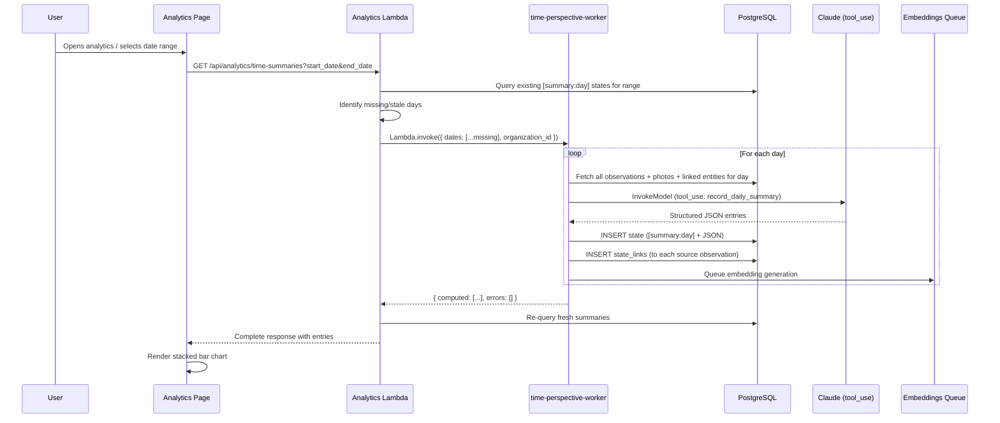

# Design Document: Time Perspective (Daily Summaries)

## 1. Architecture Overview

The Time Perspective system generates AI-computed daily time summaries stored as `[summary:day]` states. It follows the existing state/embedding pattern — no new tables, fully searchable by Maxwell via UnifiedSearch.

### Key Components

| Component | Purpose |
|-----------|---------|
| `time-perspective-worker` Lambda | Fetches day's observations, calls Bedrock, stores summary state |
| Analytics API endpoint | Serves parsed summaries, triggers on-demand computation |
| States Lambda (staleness hook) | Marks summaries stale when new observations arrive |
| Frontend TimeAllocationChart | Stacked bar chart on analytics page |
| Embedding pipeline (existing) | Makes summaries searchable by Maxwell |

### Sequence: On-Demand Computation



## 2. time-perspective-worker Lambda

### Invocation Payload

```json
{
  "organization_id": "00000000-0000-0000-0000-000000000001",
  "dates": ["2026-07-12", "2026-07-11"],
  "force_recompute": false
}
```

### Response

```json
{
  "computed": [
    { "date": "2026-07-12", "observations_count": 5, "success": true },
    { "date": "2026-07-11", "observations_count": 3, "success": true }
  ],
  "errors": []
}
```

### Day Processing Logic

For each date:

1. **Check existing**: Query for `[summary:day]` state with matching date in state_text JSON. Skip if exists and not stale (unless `force_recompute`).

2. **Fetch observations**: 
```sql
SELECT 
  s.id, s.state_text, s.captured_at, s.captured_by,
  om.full_name as captured_by_name,
  (SELECT json_agg(json_build_object(
    'photo_url', sp.photo_url,
    'photo_description', sp.photo_description,
    'captured_at', sp.created_at,
    'ai_description', (
      SELECT s2.state_text FROM state_links sl2
      JOIN states s2 ON sl2.state_id = s2.id
      WHERE sl2.entity_type = 'state_photo' AND sl2.entity_id = sp.id
        AND s2.state_text LIKE '[photo_analysis]%'
      LIMIT 1
    )
  )) FROM state_photos sp WHERE sp.state_id = s.id) as photos,
  (SELECT json_agg(json_build_object(
    'entity_type', sl.entity_type,
    'entity_id', sl.entity_id,
    'entity_name', COALESCE(a.title, t.name, p.name)
  )) FROM state_links sl
  LEFT JOIN actions a ON sl.entity_type = 'action' AND sl.entity_id = a.id
  LEFT JOIN tools t ON sl.entity_type = 'tool' AND sl.entity_id = t.id
  LEFT JOIN parts p ON sl.entity_type = 'part' AND sl.entity_id = p.id
  WHERE sl.state_id = s.id) as linked_entities
FROM states s
LEFT JOIN organization_members om ON s.captured_by::text = om.cognito_user_id::text
  AND om.organization_id = s.organization_id
WHERE s.organization_id = $1
  AND (s.captured_at AT TIME ZONE 'Asia/Manila')::date = $2
  AND (s.state_text IS NULL OR s.state_text NOT LIKE '[summary:%')
  AND (s.state_text IS NULL OR s.state_text NOT LIKE '[stale]%')
  AND (s.state_text IS NULL OR s.state_text NOT LIKE '[photo_analysis]%')
  AND (s.state_text IS NULL OR s.state_text NOT LIKE '[learning_objective]%')
  AND (s.state_text IS NULL OR s.state_text NOT LIKE '[capability_profile]%')
  AND (s.state_text IS NULL OR s.state_text NOT LIKE '{"type":"maxwell_interaction"%')
ORDER BY s.captured_at
```

3. **Build Bedrock prompt** with all observations as context.

4. **Invoke Bedrock** with tool_use (see below).

5. **Store result** as a new state + state_links + queue embedding.

### Bedrock Prompt & Tool Schema

```javascript
const systemPrompt = `You are estimating how people at Stargazer Farm spent their time on a specific day. You will be given all observations (work logs with photos) recorded that day across all team members.

Your job: produce one entry per person per distinct activity, estimating hours spent.

Evidence strength (use the strongest available):
1. Photo timestamps bracketing an activity (strongest)
2. Explicitly stated duration in text ("spent 3 hours", "the whole day")
3. Time gaps between observations
4. Known patterns (see below)

Known team patterns:
- Stefan (${STEFAN_ID}): typically computer/AI/admin work until 14:00-15:00, then outdoor/agriculture
- Stefan documents observations on behalf of Mae frequently
- Electrical work typically involves Stefan + Lester together
- Government office trips to Roxas typically involve Stefan + Mae + Lester
- Morning chicken care is routine (~0.5-1 hour)
- "whole morning" ≈ 4 hours, "spent the day" ≈ 8 hours, "afternoon" ≈ 4 hours

Rules:
- Do NOT force totals to equal 8 hours. Report what evidence supports.
- If evidence is insufficient, set confidence to "unknown"
- energy_weights must sum to 1.0 (dynamis=exploration/growth, oikonomia=sustaining operations, techne=improving how work is done)
- boundary_type: "internal" for farm/org operations, "external" for government/vendor/agency interactions
- tags: include relevant agencies (SEC, BIR, DENR, SSS), activity types (electrical, livestock, AI), or qualifiers (rework)
- Include unaccounted time in notes field`;

const toolConfig = {
  tools: [{
    toolSpec: {
      name: 'record_daily_summary',
      description: 'Record the structured daily time summary',
      inputSchema: {
        json: {
          type: 'object',
          properties: {
            entries: {
              type: 'array',
              items: {
                type: 'object',
                properties: {
                  user_id: { type: 'string', description: 'Cognito user ID of the person' },
                  activity: { type: 'string', description: 'What was done' },
                  hours: { type: 'number', description: 'Estimated hours' },
                  confidence: { type: 'string', enum: ['high', 'medium', 'low', 'unknown'] },
                  evidence: { type: 'string', description: 'Why this estimate — cite timestamps, stated durations, or inference' },
                  source_ids: { type: 'array', items: { type: 'string' }, description: 'State IDs that informed this entry' },
                  energy_weights: {
                    type: 'object',
                    properties: {
                      dynamis: { type: 'number' },
                      oikonomia: { type: 'number' },
                      techne: { type: 'number' }
                    },
                    required: ['dynamis', 'oikonomia', 'techne']
                  },
                  boundary_type: { type: 'string', enum: ['internal', 'external'] },
                  tags: { type: 'array', items: { type: 'string' } }
                },
                required: ['user_id', 'activity', 'hours', 'confidence', 'evidence', 'source_ids', 'energy_weights', 'boundary_type', 'tags']
              }
            },
            notes: { type: 'string', description: 'Unaccounted time, gaps, or caveats about the day' }
          },
          required: ['entries', 'notes']
        }
      }
    }
  }],
  toolChoice: { tool: { name: 'record_daily_summary' } }
};
```

### User Prompt Construction

```javascript
const userPrompt = `Date: ${date} (${dayOfWeek})

Team members:
- Stefan Hamilton (${STEFAN_ID})
- Mae Dela Torre (${MAE_ID})  
- Lester Paniel (${LESTER_ID})

Observations recorded this day (${observations.length} total):

${observations.map((obs, i) => `
--- Observation ${i + 1} ---
Recorded by: ${obs.captured_by_name} (${obs.captured_by})
Time: ${obs.captured_at}
Text: ${obs.state_text || '(no text)'}
Linked to: ${obs.linked_entities?.map(e => `${e.entity_type}: "${e.entity_name}"`).join(', ') || 'none'}
Photos: ${obs.photos?.map(p => {
  const parts = [];
  if (p.captured_at) parts.push(`timestamp: ${p.captured_at}`);
  if (p.photo_description) parts.push(`caption: ${p.photo_description}`);
  if (p.ai_description) parts.push(`AI: ${p.ai_description.replace('[photo_analysis] ', '')}`);
  return parts.join(', ');
}).join(' | ') || 'none'}
`).join('\n')}

Produce a time estimate for each person for each distinct activity.`;
```

## 3. API Endpoint: GET /api/analytics/time-summaries

### Handler Location

`lambda/analytics/index.js` (or new `lambda/time-summaries/index.js`)

### Query Parameters

| Param | Required | Description |
|-------|----------|-------------|
| start_date | Yes | YYYY-MM-DD |
| end_date | Yes | YYYY-MM-DD |
| user_id | No | Filter entries by person |
| tags | No | Comma-separated, filter entries containing any of these tags |
| boundary_type | No | "internal" or "external" |
| confidence | No | Minimum confidence level to include |

### Logic

1. Query all `[summary:day]` states in date range for the org
2. Identify days with no summary or stale summary
3. If missing/stale days exist: invoke `time-perspective-worker` synchronously
4. Parse JSON from state_text for each summary
5. Apply client-side filters (user_id, tags, boundary_type, confidence)
6. Return structured response

### SQL to Find Existing Summaries

```sql
SELECT s.id, s.state_text, s.captured_at
FROM states s
WHERE s.organization_id = $1
  AND s.state_text LIKE '[summary:day]%'
  AND (s.state_text::json->>'date')::date BETWEEN $2 AND $3
ORDER BY (s.state_text::json->>'date')::date
```

Note: For stale detection, also query:
```sql
SELECT s.id, s.state_text
FROM states s
WHERE s.organization_id = $1
  AND s.state_text LIKE '[stale][summary:day]%'
  AND ... date range ...
```

## 4. Staleness Detection Hook

### Location

`lambda/states/index.js` — in the `createState` function, after the main INSERT + state_links commit.

### Logic (post-commit, non-blocking)

```javascript
// After successful state creation, check if a daily summary exists for this day
const phtDate = new Date(state.captured_at).toLocaleDateString('en-CA', { timeZone: 'Asia/Manila' });

const staleResult = await client.query(`
  UPDATE states 
  SET state_text = '[stale]' || state_text
  WHERE organization_id = $1
    AND state_text LIKE '[summary:day]%'
    AND state_text LIKE '%"date":"${phtDate}"%'
    AND state_text NOT LIKE '[stale]%'
  RETURNING id
`, [organizationId]);

if (staleResult.rowCount > 0) {
  console.log(`[STATES] Marked ${staleResult.rowCount} daily summary as stale for ${phtDate}`);
}
```

### Error Handling

Staleness marking is **best-effort**. If it fails, log and continue — the summary will just be served slightly stale until the next recomputation.

## 5. Frontend: TimeAllocationChart Component

### Location

`src/components/analytics/TimeAllocationChart.tsx`

### Data Flow

```
useTimeSummaries(startDate, endDate) hook
  → GET /api/analytics/time-summaries
  → returns { summaries, computation_status }
  → component renders stacked bar chart
```

### Chart Design

- **Library**: Recharts (consistent with existing analytics charts)
- **Chart type**: Stacked BarChart
- **X-axis**: Days (or weeks/months with aggregation toggle)
- **Y-axis**: Hours
- **Stacks**: Colored by top tag (or by energy_type dominant)
- **Color scheme**: Match Energeia colors (dynamis=#ff6b35, oikonomia=#00e5ff, techne=#a855f7)

### Interaction

- **Hover**: Show tooltip with person, activity, hours, confidence
- **Click bar segment**: Open detail drawer showing:
  - All entries for that day/segment
  - Evidence text for each entry
  - Link to source observations (`/observations?date=YYYY-MM-DD&highlight=id1,id2`)
  - Confidence badge (color-coded)
- **Filters** (above chart):
  - Person selector (multi-select)
  - Tag filter (multi-select, populated from data)
  - Boundary type toggle (internal/external/all)
  - Confidence threshold (show all / hide unknown / high only)
  - Aggregation (day / week / month)

### Loading/Computing States

- Show skeleton chart while loading
- If computation is triggered, show progress: "Computing summaries for 5 days..."
- Show stale indicator badge if some data is stale

## 6. Embedding Composition for Summary States

### Function

Added to `lambda/layers/cwf-common-nodejs/nodejs/embedding-composition.js`:

```javascript
/**
 * Compose embedding source for a daily time summary state.
 * Renders JSON into natural language for semantic search.
 */
function composeTimeSummaryEmbeddingSource(summary, nameMap = {}) {
  const parts = [`Daily time summary for ${summary.date}`];
  for (const entry of (summary.entries || [])) {
    const name = nameMap[entry.user_id] || 'Unknown';
    const tags = entry.tags?.length > 0 ? ` (${entry.tags.join(', ')})` : '';
    parts.push(`${name} spent ${entry.hours} hours on ${entry.activity}${tags}`);
  }
  if (summary.notes) parts.push(`Notes: ${summary.notes}`);
  return parts.join('. ');
}
```

### Embedding Lifecycle

1. Summary created → embedding queued via SQS → vector stored in unified_embeddings
2. Summary marked stale → embedding remains (still findable but stale indicator in state_text)
3. Summary recomputed → old state deleted (cascade deletes embedding) → new state + fresh embedding

## 7. Observation List Filtering

Summary states excluded from the observations list by adding to `listStates` query:

```sql
AND (s.state_text IS NULL OR s.state_text NOT LIKE '[summary:%')
AND (s.state_text IS NULL OR s.state_text NOT LIKE '[stale][summary:%')
```

## 8. Deployment Plan

1. Deploy `time-perspective-worker` Lambda with layer
2. Add `/api/analytics/time-summaries` endpoint to API Gateway
3. Add staleness hook to states Lambda (deploy states)
4. Deploy frontend TimeAllocationChart component
5. Add filter to observations list (deploy states)

## 9. Cost Estimate

- **Per day computation**: 1 Bedrock call with ~2-5K input tokens (all observations) + ~500-1K output tokens (structured JSON)
- **At Haiku 4.5 pricing**: ~$0.003-0.008 per day
- **30-day backfill**: ~$0.10-0.25
- **Ongoing**: computed once per day, only recomputed on staleness (new observation same day)
- **Nightly batch (optional)**: $0.003/day = ~$0.09/month
