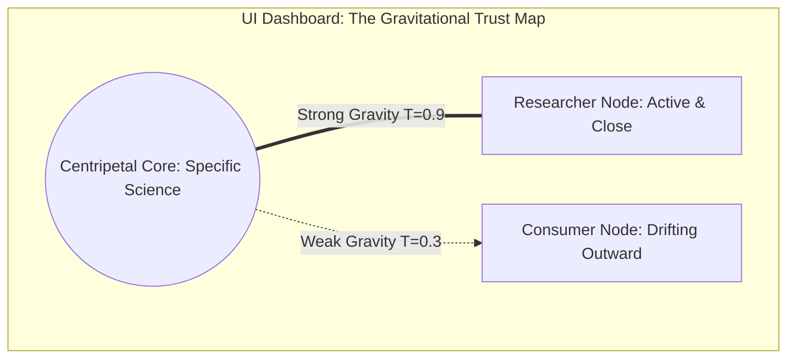

# Specification: The Trust Orbit Coordination Model

## 1. Philosophical Context: Trust as a Dynamic Orbit

In traditional corporate software, trust is binary and static: you are either an "admin" or a "viewer" (RBAC). In **Centripetal ES**, we seek a more natural, organic, and self-regulating mechanism for community coordination and knowledge sharing.

We model trust as a **gravitational orbit**:
*   At the **Centripetal Core** sits our high-fidelity, highly specific knowledge hub (detailed crop science, exact sensor coordinates, premium tool logs).
*   Each external participant (researchers, farm cooperatives, grant bodies) is an **Orbiting Body** whose distance from the core represents their level of trust.
*   Trust must be earned and maintained. **Consumption** (taking value without giving back) creates centrifugal force, drifting the orbit **outward** to generic, redacted data tiers.
*   **Contribution** (uploading verification logs, correcting data, sharing findings) creates centripetal gravity, pulling the orbit **inward** toward specific, high-fidelity data tiers.

---

## 2. Mathematical Dynamics of the Orbit

Let $T(t) \in [0, 1]$ represent the participant's **Trust Coefficient** at time $t$:

### 1. Orbit Radius ($R$)
The orbital distance of the participant's body from the knowledge core:
$$R(t) = R_{\text{min}} + (1 - T(t)) \cdot (R_{\text{max}} - R_{\text{min}})$$
*   **$T(t) \to 1$ (High Trust)**: $R(t) \to R_{\text{min}}$. The body enters a tight, high-speed orbit, unlocking exact telemetry and specific tool models.
*   **$T(t) \to 0$ (Low Trust)**: $R(t) \to R_{\text{max}}$. The body drifts to the cold outer rings, limited to generic redacted public narratives.

### 2. Trust Decay (Consumption without Contribution)
Every time a participant consumes high-fidelity data (e.g. exporting maps, querying detailed API metrics) without contributing, their trust decays:
$$T(t + 1) = T(t) \cdot e^{-\lambda \cdot c}$$
*   $\lambda$ is the decay rate (e.g., $0.05$).
*   $c$ is the unit count of consumed data points.

### 3. Gravitational Pull (Contribution Refreshes Trust)
When a participant contributes back to the ecosystem (e.g., verifying a crop observation, submitting soil sensor samples, uploading a tool checkout proof), they generate gravity:
$$T(t_{\text{new}}) = \min\left(1, T(t) + \alpha \cdot g\right)$$
*   $\alpha$ is the gravity multiplier (e.g., $0.15$).
*   $g$ is the verified value of the contribution.

### 4. Keplerian Angular Velocity ($\omega$)
To represent active interaction, closer orbiting bodies move faster, while distant bodies move slowly:
$$\omega(t) \propto R(t)^{-1.5}$$

---

## 3. Data Tier Mappings based on Orbital Distance

| Orbital Zone | Trust Range | UI Visibility & Telemetry Tier | Specifics Unlocked |
| :--- | :--- | :--- | :--- |
| **Inner Orbit (Zone I)** | $0.8 \le T \le 1.0$ | **High-Fidelity Specifics** | Precise telemetry, specific machinery models, unblurred maps, direct API access. |
| **Mid Orbit (Zone II)** | $0.4 \le T < 0.8$ | **Decoupled Context** | Specific tech names & metrics, but completely decoupled from storage sites or schedules. |
| **Outer Orbit (Zone III)** | $0.1 \le T < 0.4$ | **Redacted Narratives** | Narrative impact stories with fully generic terms (e.g. "aerial mapping unit" instead of "DJI drone"). |
| **System Escape (Zone IV)** | $0.0 \le T < 0.1$ | **Access Denied** | Minimal public metrics, no API access. |

---

## 4. Visualizing the Orbit in the Portal (Emergent Aesthetics)

We can translate this mathematical model into a stunning, interactive **Three.js WebGL visualization** inside the dashboard (perfect for the premium design standards of Centripetal ES).

### Aesthetic Dynamics
1. **Interactive Orbit Map**: A beautiful 3D particle field showing the participant’s planetary node revolving around the Centripetal Core.
2. **Visual Decay Feedback**: As the user consumes data, their planet visually drifts farther from the core, its orbital trail turning from **vibrant Emerald** to **cool Slate Blue**, and its speed slowing down.
3. **The "Contribution Snap"**: When they contribute a verified observation, a beam of energy transfers from their node to the core, and their planet **snaps inward**, speeding up and lighting up the orbital path.
4. **Transparent Status Banner**:
   * `"Current Trust Quotient: 0.85 — Core Specifics Unlocked"`
   * `"Orbital Status: Stable, highly aligned."`
